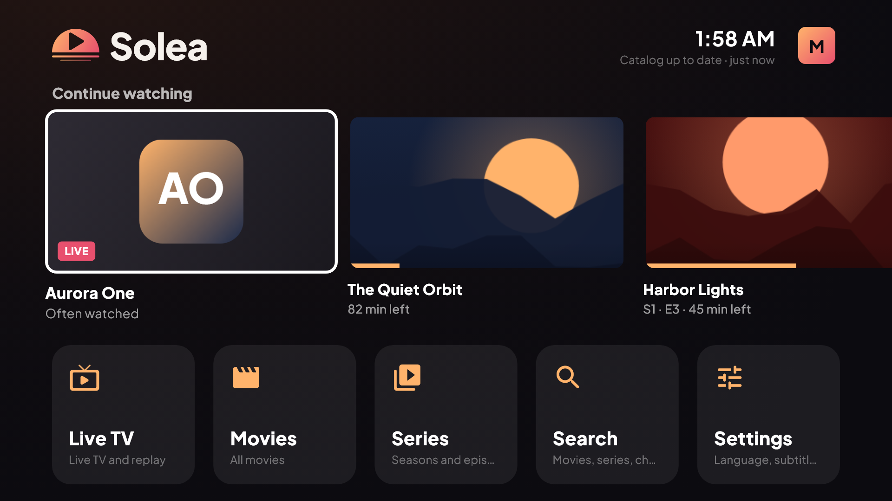
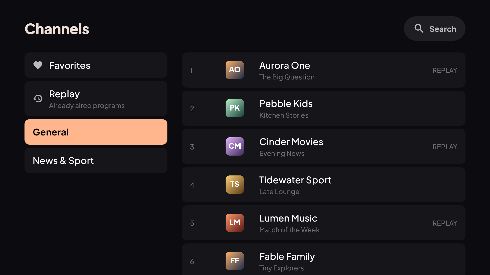
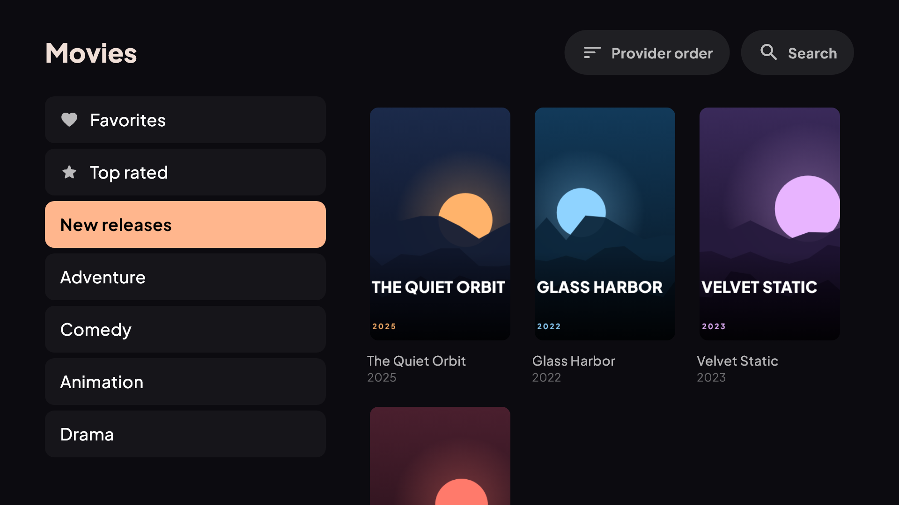
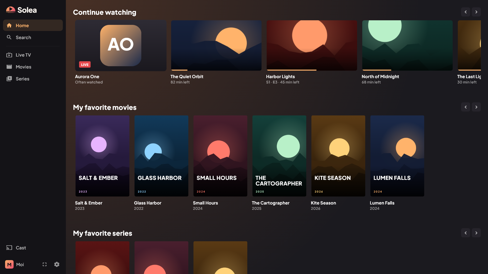
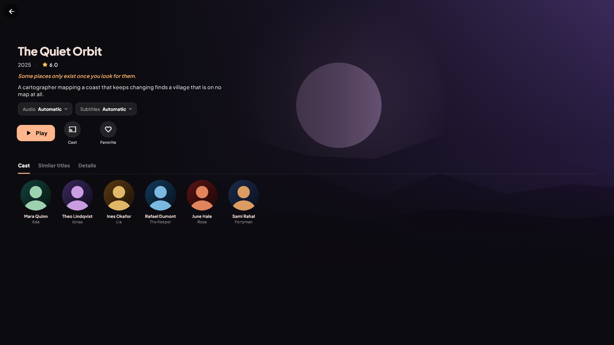
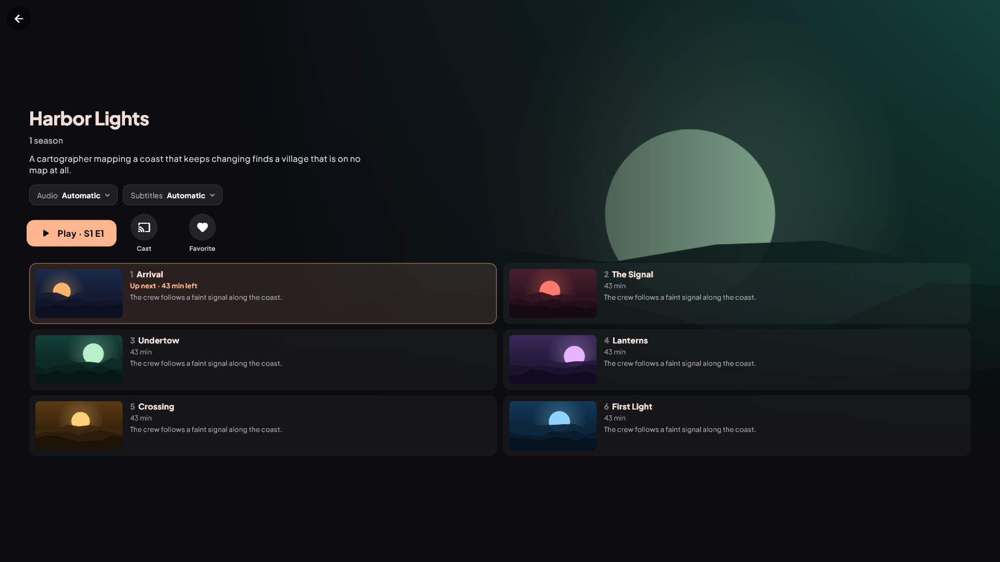
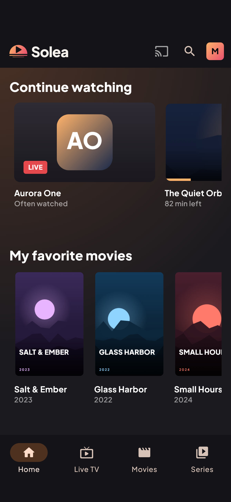
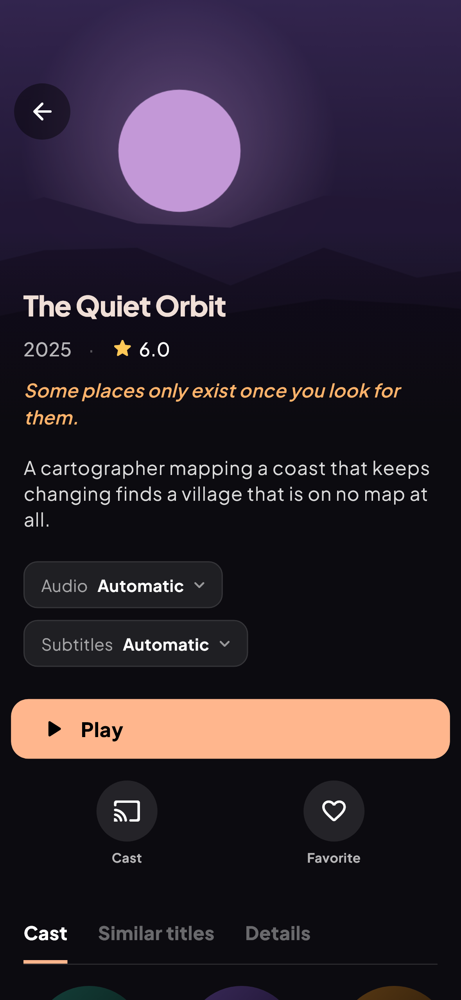
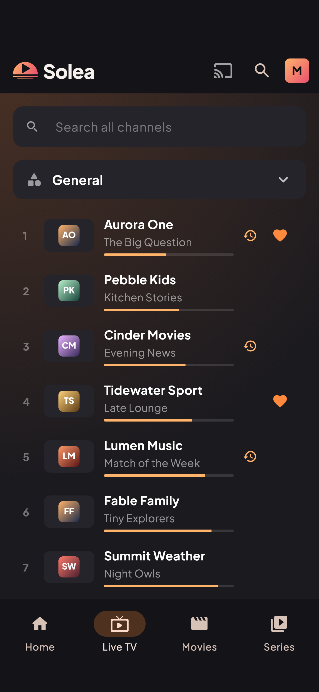

<h1 align="center">
  <br>
  
  <br>
  Solea
  <br>
</h1>

<h4 align="center">A TV-first video player for the subscription you already have, built with <a href="https://flutter.dev/" target="_blank">Flutter</a> and <a href="https://claude.com/claude-code" target="_blank">Claude</a>.</h4>

<p align="center">
  <a href="#download">Download</a> •
  <a href="#key-features">Key Features</a> •
  <a href="#screenshots">Screenshots</a> •
  <a href="#community">Community</a> •
  <a href="#planned-features">Planned Features</a> •
  <a href="#built-with-claude">Built with Claude</a> •
  <a href="#credits">Credits</a> •
  <a href="#license">License</a>
</p>

<div align="center">

  [](https://github.com/gabrielchamak/solea-releases/releases/latest)
  [](https://github.com/gabrielchamak/solea-releases/releases)
  [](https://discord.gg/42FVvupACy)
  [](#built-with-claude)

</div>

> [!IMPORTANT]
> Solea is a player, just as a web browser is for web pages. It **provides, sells and recommends no content and no
> subscription**: it only plays the sources you add yourself, and you must have the right to watch them.

This repository hosts the **releases** of Solea (downloads and release notes). The source code is private.

## Download

Get the latest version on the [releases page](https://github.com/gabrielchamak/solea-releases/releases/latest):

* **Android TV, Fire TV, Android phones and tablets** – `Solea-<version>-android.apk`
* **Windows** – `Solea-<version>-Setup.exe` (installer) or `Solea-<version>-windows.zip` (portable)
* **iPhone, iPad** – with SideStore: see below

### iPhone and iPad with SideStore

Solea installs on iPhone and iPad with [SideStore](https://sidestore.io), for free, with your own Apple Account. You need
a computer once (about 10 minutes); after that, updates arrive on the iPhone. Step-by-step guide:
**[solea.tv/en/install-iphone](https://solea.tv/en/install-iphone/)**.

Already have SideStore? Add the Solea source (Sources › +):

```
https://raw.githubusercontent.com/gabrielchamak/solea-releases/main/sidestore.json
```

> [!WARNING]
> (Windows) Like other unsigned apps, Solea may be flagged by Windows SmartScreen on first launch: choose
> “More info” › “Run anyway”.

## Key Features

* Live TV, movies, series and replay from your own subscription, with the program guide
* Several versions of a title shown as one (quality, language) – the best one your device can play is picked for you
* Forgiving search – typos, accents, missing spaces
* Rich movie and series pages – backdrops, cast with photos, trailers, similar titles (TMDB)
* Anime library (optional) – dubbed or in Japanese with subtitles
* Plays everything – hardware decoding on Android, mpv elsewhere: MKV, H.265, HDR, AC3, DTS…
* Remembers your audio and subtitle choices per title, resumes where you left off
* Subtitles from OpenSubtitles in your language, with a sync tool when they are out of time
* Skip intro and recap, next episode, playback speed, picture-in-picture on Android
* Multiple profiles – PIN codes, parental control, favorites and “Continue watching” per profile
* Cast to Chromecast (Dolby and DTS audio converted on the fly, subtitles included), to another Solea box or to
  DLNA TVs
* Optional Solea account – profiles, favorites and progress synced across devices, end-to-end encrypted
* A TV interface built for the remote, and a full interface for mouse, keyboard and touch
* French and English
* Platforms
  - Android TV + Fire TV
  - Android phones and tablets
  - iPhone + iPad
  - Windows


## Screenshots

> All titles, channels, programs, posters and cast below are fictional, made up for these screenshots.

<p align="center">
  
  
</p>
<p align="center">
  
  
</p>
<p align="center">
  
  
</p>
<p align="center">
  
  
  
</p>

## Community

Questions, bug reports, ideas, beta versions: join us on **[Discord](https://discord.gg/42FVvupACy)**.

You can also open an [issue](https://github.com/gabrielchamak/solea-releases/issues):
- check first that it hasn't been reported already;
- give the steps to reproduce it, your device (TV box model, phone, Windows…) and your Solea version;
- **never** paste your subscription address, username, password or playlist address.

## Planned Features

### New in 0.9.0

| Feature | Tested on a device |
|---|---|
| Sign in a TV from your phone through solea.tv – scan the QR code, type on your phone; end-to-end encrypted, no need to be on the same Wi-Fi | ✅ Fire TV · 🧪 with a real phone scanning the code |
| M3U playlists, with their XMLTV program guide | ✅ Fire TV, playlist of channels · 🧪 playlist with movies |
| No empty pages: Movies, Series and Anime hidden when your subscription has none | ✅ Fire TV |
| Picture in Picture on iPhone and iPad (leave the app or tap the button), Picture in Picture button on Android phones | 🧪 iPhone, Android phones |
| Player gestures explained the first time on phones and tablets | ✅ |
| Settings › About: contact, privacy, terms of use, open source licenses | ✅ Fire TV |
| "Continue without an account" remembered; "Continue watching" only shows titles of the current subscription | ✅ Fire TV |

### Built, not tested yet

| Feature | Not tested yet on |
|---|---|
| Anime library | Fire TV, phones (✅ Windows) |
| PIN codes and parental control per profile | all devices |
| Casting to a Chromecast from an Android phone (Dolby / DTS converted) | Android phones |
| Casting to DLNA TVs (Samsung, LG…) | Windows |
| Touch gestures in the player (pinch, double tap, long press, swipe) | Android phones, iPhone |
| Floating mini player | Windows, iPad |
| "Now Playing" on the iPhone lock screen | iPhone |

### Later

* Samsung TVs (Tizen) – prototype working on the emulator
* Apple TV
* Program guide (EPG) as a grid, program reminders
* Series in M3U playlists

## Built with Claude

Solea is built by [@gabrielchamak](https://github.com/gabrielchamak) together with **Claude**, Anthropic's AI, using
[Claude Code](https://claude.com/claude-code). Gabriel decides what the app should be and tests every feature on real
devices (TV boxes, Fire TV, iPhone, Windows); Claude writes most of the code, researches the hard parts (video decoding,
Chromecast audio conversion, subtitle sync, audio language detection…) and runs the tests.

## Credits

This software uses the following services and open source projects:
- [Flutter](https://flutter.dev/)
- [TMDB](https://www.themoviedb.org) – movie and series data and images. *This product uses the TMDB API but is not
  endorsed or certified by TMDB.*
- [OpenSubtitles](https://www.opensubtitles.com) – subtitles; [TheIntroDB](https://theintrodb.org) – intro and recap timings
- [ExoPlayer / Media3](https://developer.android.com/media/media3), [mpv](https://mpv.io) through
  [media_kit](https://github.com/media-kit/media-kit), [FFmpeg](https://ffmpeg.org) (LGPL) – playback
- [iptv-org](https://github.com/iptv-org) – channel logos; [flag-icons](https://github.com/lipis/flag-icons) (MIT) – flags
- [Plus Jakarta Sans](https://github.com/tokotype/PlusJakartaSans) (SIL Open Font License) – font

## License

© Gabriel Chamak. All rights reserved. Solea is free to download and use; it may not be modified, resold or
redistributed.
